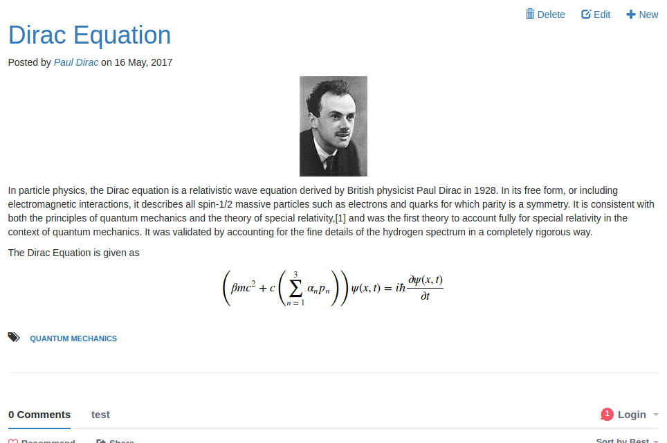
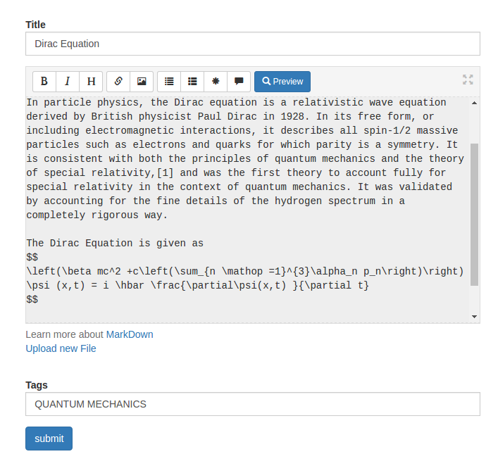

.. Flask-Blogging documentation master file, created by
   sphinx-quickstart on Fri May 29 12:51:58 2015.
   You can adapt this file completely to your liking, but it should at least
   contain the root `toctree` directive.

==============
Flask-Blogging
==============

Flask-Blogging is a Flask extension for adding Markdown based blog support to your site.
It provides a flexible mechanism to store the data in the database
of your choice. It is meant to work with the authentication
provided by packages such as
`Flask-Login <https://flask-login.readthedocs.org/en/latest/>`_ or
`Flask-Security <https://pythonhosted.org/Flask-Security/>`_.

The philosophy behind this extension is to provide a lean app based on Markdown
to provide blog support to your existing web application. This is contrary
to some other packages such as `Flask-Blog <https://github.com/dmaslov/flask-blog>`_
that are just blogs. If you already have a
web app and you need to have a blog to communicate with your user or to
promote your site through content based marketing, then Flask-Blogging would help
you quickly get a blog up and running.

Out of the box, Flask-Blogging has support for the following:

- Bootstrap based site
- Markdown based blog editor
- Models to store blog
- Authentication of User's choice
- Sitemap, ATOM support
- Disqus support for comments
- Google analytics for usage tracking
- Permissions enabled to control which users can create/edit blogs
- Integrated Flask-Cache based caching for optimization
- Well documented, tested, and extensible design

.. contents::
   :local:
   :backlinks: none

Quick Start Example
===================

.. code:: python

    from flask import Flask, render_template_string, redirect
    from sqlalchemy import create_engine, MetaData
    from flask.ext.login import UserMixin, LoginManager, \
        login_user, logout_user
    from flask.ext.blogging import SQLAStorage, BloggingEngine

    app = Flask(__name__)
    app.config["SECRET_KEY"] = "secret"  # for WTF-forms and login
    app.config["BLOGGING_URL_PREFIX"] = "/blog"
    app.config["BLOGGING_DISQUS_SITENAME"] = "test"
    app.config["BLOGGING_SITEURL"] = "http://localhost:8000"

    # extensions
    engine = create_engine('sqlite:////tmp/blog.db')
    meta = MetaData()
    sql_storage = SQLAStorage(engine, metadata=meta)
    blog_engine = BloggingEngine(app, sql_storage)
    login_manager = LoginManager(app)
    meta.create_all(bind=engine)

    # user class for providing authentication
    class User(UserMixin):
        def __init__(self, user_id):
            self.id = user_id

        def get_name(self):
            return "Paul Dirac"  # typically the user's name

    @login_manager.user_loader
    @blog_engine.user_loader
    def load_user(user_id):
        return User(user_id)

    index_template = """
    <!DOCTYPE html>
    <html>
        <head> </head>
        <body>
            
                <a href="/logout/">Logout</a>
            
                <a href="/login/">Login</a>
            
            &nbsp&nbsp<a href="/blog/">Blog</a>
            &nbsp&nbsp<a href="/blog/sitemap.xml">Sitemap</a>
            &nbsp&nbsp<a href="/blog/feeds/all.atom.xml">ATOM</a>
        </body>
    </html>
    """

    @app.route("/")
    def index():
        return render_template_string(index_template)

    @app.route("/login/")
    def login():
        user = User("testuser")
        login_user(user)
        return redirect("/blog")

    @app.route("/logout/")
    def logout():
        logout_user()
        return redirect("/")

    if __name__ == "__main__":
        app.run(debug=True, port=8000, use_reloader=True)

The key components required to get the blog hooked is explained below. Please note
that as of Flask-Login 0.3.0 the ``is_authenticated`` attribute in the ``UserMixin``
is a property and not a method. Please use the appropriate option based on your
Flask-Login version.

Configuring your Application
============================

The `BloggingEngine` class is the gateway to configure blogging support
to your web app. You should create the `BloggingEngine` instance like this::

    blogging_engine = BloggingEngine()
    blogging_engine.init_app(app, storage)

You also need to pick the ``storage`` for blog. That can be done as::

    from sqlalchemy import create_engine, MetaData

    engine = create_engine("sqlite:////tmp/sqlite.db")
    meta = MetaData()
    storage = SQLAStorage(engine, metadata=meta)
    meta.create_all(bind=engine)

Here we have created the storage, and created all the tables
in the metadata. Once you have created the blogging engine,
storage, and all the tables in the storage, you can connect
with your app using the `init_app` method as shown below::

   blogging_engine.init_app(app, storage)

If you are using ``Flask-Sqlalchemy``, you can do the following::

    from flask.ext.sqlalchemy import SQLAlchemy

    db = SQLAlchemy(app)
    storage = SQLAStorage(db=db)
    db.create_all()

One of the changes in version 0.3.1 is the ability for the user
to provide the ``metadata`` object. This has the benefit of the
table creation being passed to the user. Also, this gives the user
the ability to use the common metadata object, and hence helps
with the tables showing up in migrations while using Alembic.

As of version 0.4.0, Flask-Cache integration is supported. In order
to use caching in the blogging engine, you need to pass the ``Cache``
instance to the ``BloggingEngine`` as::

    from flask.ext.cache import Cache
    from flask.ext.blogging import BloggingEngine

    blogging_engine = BloggingEngine(app, storage, cache)

*Flask-Blogging* lets the developer pick the authentication
that is suitable, and hence requires her to provide a way to load user
information. You will need to provide a `BloggingEngine.user_loader`
callback. This callback is used to load the user from the `user_id`
that is stored for each blog post. Just as in Flask-Login, it should take the
`unicode` `user_id` of a user, and return the corresponding user
object. For example::

    @blogging_engine.user_loader
    def load_user(userid):
        return User.get(userid)

For the blog to have a readable display name, the ``User`` class must
implement either the ``get_name`` method or the ``__str__`` method.

The ``BloggingEngine`` accepts an optional ``extensions`` argument. This is a list
of ``Markdown`` extensions objects to be used during the markdown processing step.

The ``BloggingEngine`` also accepts ``post_processor`` argument, which can be
used to provide a custom post processor object to handle the processing
of Markdown text. An ideal way to do this would be to inherit the default
``PostProcessor`` object and override custom methods. There is a
``custom_process`` method that can be overridden to add extra functionality
to the post processing step.

In version 0.4.1 and onwards, the ``BloggingEngine`` object can be accessed
from your ``app`` as follows::

    engine = app.extensions["blogging"]

The engine method also exposes a ``get_posts`` method to get the recent posts
for display of posts in other views.

In earlier versions the same can be done using the key
``FLASK_BLOGGING_ENGINE`` instead of ``blogging``. The use of
``FLASK_BLOGGING_ENGINE`` key will be deprecated moving forward.

Configuration Variables
=======================

The Flask-Blogging extension can be configured by setting the following app
config variables. These arguments are passed to all the views. The
keys that are currently supported include:

- ``BLOGGING_SITENAME`` (*str*): The name of the blog to be used as the brand
  name.This is also used in the feed heading. (default "Flask-Blogging")
- ``BLOGGING_SITEURL`` (*str*): The url of the site.
- ``BLOGGING_RENDER_TEXT`` (*bool*): Value to specify if the raw text should be
  rendered or not. (default ``True``)
- ``BLOGGING_DISQUS_SITENAME`` (*str*): Disqus sitename for comments.
  A ``None`` value will disable comments. (default ``None``)
- ``BLOGGING_GOOGLE_ANALYTICS`` (*str*): Google analytics code for usage
  tracking. A ``None`` value will disable google analytics. (default ``None``)
- ``BLOGGING_URL_PREFIX`` (*str*) : The prefix for the URL of blog posts. A
  ``None`` value will have no prefix (default ``None``).
- ``BLOGGING_FEED_LIMIT`` (*int*): The number of posts to limit to in the feed.
  If ``None``, then all are shown, else will be limited to this number. (default ``None``)
- ``BLOGGING_PERMISSIONS`` (*bool*): if ``True``, this will enable permissions
  for the blogging engine. With permissions enabled, the user will need to have
  "blogger" ``Role`` to edit or create blog posts. Other authenticated
  users will not have blog editing permissions. The concepts here derive
  from ``Flask-Principal`` (default ``False``)
- ``BLOGGING_POSTS_PER_PAGE`` (*int*): This sets the default number of pages
  to be displayed per page. (default 10)
- ``BLOGGING_CACHE_TIMEOUT`` (*int*): The timeout in seconds used to cache
  the blog pages. (default 60)

Blog Views
==========

There are various views that are exposed through Flask-Blogging. The URL for
the various views are:

- ``url_for('blogging.index')`` (GET): The index blog posts with the first
  page of articles.
- ``url_for('blogging.page_by_id', post_id=<post_id>)`` (GET): The blog post
  corresponding to the ``post_id`` is retrieved.
- ``url_for('blogging.posts_by_tag', tag=<tag_name>)`` (GET): The list of blog
  posts corresponding to ``tag_name`` is returned.
- ``url_for('blogging.posts_by_author', user_id=<user_id>)`` (GET): The list of
  blog posts written by the author ``user_id`` is returned.
- ``url_for('blogging.editor')`` (GET, POST): The blog editor
  is shown. This view needs authentication and permissions (if enabled).
- ``url_for('blogging.delete', post_id=<post_id>)`` (POST): The blog post
  given by ``post_id`` is deleted. This view needs authentication and
  permissions (if enabled).
- ``url_for('blogging.sitemap')`` (GET): The sitemap
  with a link to all the posts is returned.
- ``url_for('blogging.feed')`` (GET): Returns ATOM feed URL.

The view can be easily customised by the user by overriding with their own templates. The template pages that need
to be customized are:

- ``blogging/index.html``: The blog index page used to serve index of posts, posts by tag, and posts by author
- ``blogging/editor.html``: The blog editor page.
- ``blogging/page.html``: The page that shows the given article.
- ``blogging/sitemap.xml``: The sitemap for the blog posts.

Permissions
===========

In version 0.3.0 Flask-Blogging, enables permissions based on Flask-Principal.
This addresses the issue of controlling which of the authenticated users can
have access to edit or create blog posts. Permissions are enabled by setting
``BLOGGING_PERMISSIONS`` to ``True``. Only users that have access to
``Role`` "blogger" will have permissions to create or edit blog posts.

Screenshots
===========
Blog Page
---------

Blog Editor
-----------

Useful Tips
===========

- **Migrations with Alembic**: (Applies to versions 0.3.0 and earlier)
  If you have migrations part of your project
  using Alembic, or extensions such as ``Flask-Migrate`` which uses Alembic, then
  you have to modify the ``Alembic`` configuration in order for it to ignore
  the ``Flask-Blogging`` related tables. If you don't set these modifications,
  then every time you run migrations, ``Alembic`` will not recognize the
  tables and mark them for deletion. And if you happen to ``upgrade`` by mistake
  then all your blog tables will be deleted. What we will do here is ask
  Alembic to ``exclude`` the tables used by ``Flask-Blogging``. In your
  ``alembic.ini`` file, add a line::

    [alembic:exclude]
    tables = tag, post, tag_posts, user_posts

  If you have a value set for ``table_prefix`` argument while creating the ``SQLAStorage``, 
  then the table names will contain that prefix in their names. In which case, you have 
  to use appropriate names in the table names.

  And in your ``env.py``, we have to mark these tables as the ones to be
  ignored.

  ::

    def exclude_tables_from_config(config_):
        tables_ = config_.get("tables", None)
        if tables_ is not None:
            tables = tables_.split(",")
        return tables

    exclude_tables = exclude_tables_from_config(config.get_section('alembic:exclude'))

    def include_object(object, name, type_, reflected, compare_to):
        if type_ == "table" and name in exclude_tables:
            return False
        else:
            return True

    def run_migrations_online():
        """Run migrations in 'online' mode.

        In this scenario we need to create an Engine
        and associate a connection with the context.

        """
        engine = engine_from_config(
                    config.get_section(config.config_ini_section),
                    prefix='sqlalchemy.',
                    poolclass=pool.NullPool)

        connection = engine.connect()
        context.configure(
                    connection=connection,
                    target_metadata=target_metadata,
                    include_object=include_object,
                    compare_type=True
                    )

        try:
            with context.begin_transaction():
                context.run_migrations()
        finally:
            connection.close()

  In the above, we are using ``include_object`` in ``context.configure(...)``
  to be specified based on the ``include_object`` function.

.. include:: releases.rst

API Documentation
=================

Module contents
---------------

.. automodule:: flask_blogging
    :members:
    :undoc-members:
    :show-inheritance:

Submodules
----------

flask_blogging.engine module
----------------------------

.. automodule:: flask_blogging.engine
    :members:
    :undoc-members:
    :show-inheritance:

flask_blogging.processor module
-------------------------------

.. autoclass:: flask_blogging.processor.PostProcessor
    :members:
    :undoc-members:
    :show-inheritance:

flask_blogging.sqlastorage module
---------------------------------

.. automodule:: flask_blogging.sqlastorage
    :members:
    :undoc-members:
    :show-inheritance:

flask_blogging.storage module
-----------------------------

.. automodule:: flask_blogging.storage
    :members:
    :undoc-members:
    :show-inheritance:

flask_blogging.views module
---------------------------

.. automodule:: flask_blogging.views
    :members:
    :undoc-members:
    :show-inheritance:

flask_blogging.forms module
---------------------------

.. automodule:: flask_blogging.forms
    :members:
    :undoc-members:

.. include:: authors.rst
